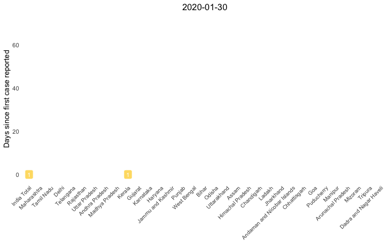
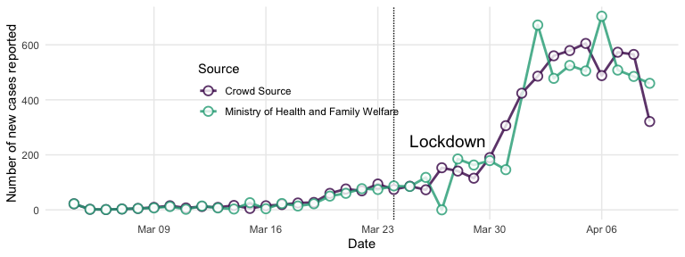
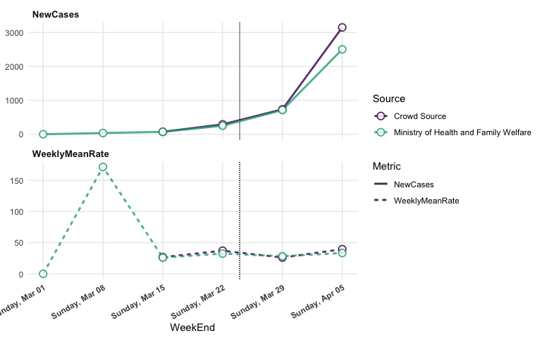
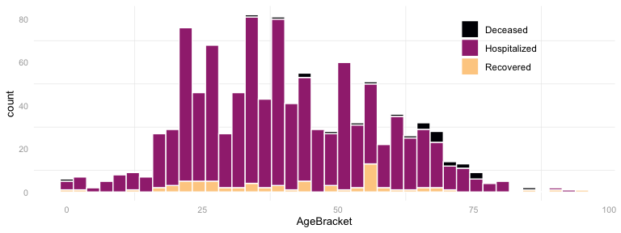
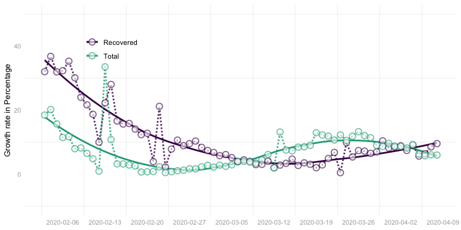
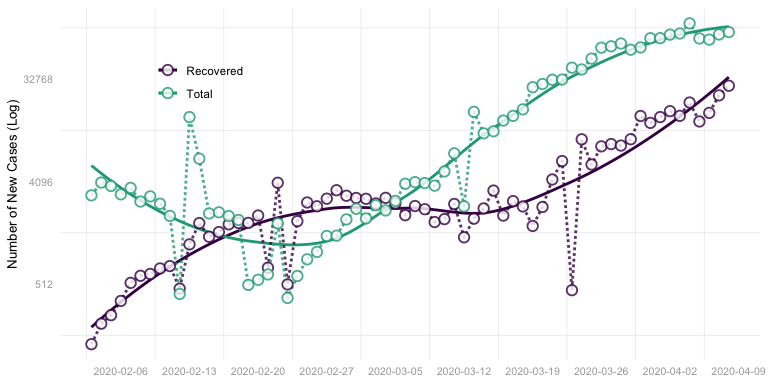
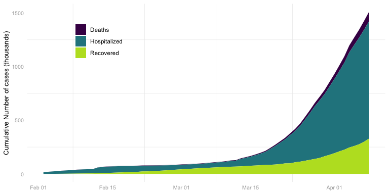

<!-- ## Current Status -->
<table class="table table-striped table-hover" style="width: auto !important; float: right; margin-left: 10px;">
<thead>
<tr>
<th style="text-align:left;">
Status
</th>
<th style="text-align:right;">
Crowd Source
</th>
<th style="text-align:right;">
Ministry of Health and Family Welfare
</th>
</tr>
</thead>
<tbody>
<tr>
<td style="text-align:left;">
Deceased
</td>
<td style="text-align:right;">
28
</td>
<td style="text-align:right;">
166
</td>
</tr>
<tr>
<td style="text-align:left;">
Hospitalized
</td>
<td style="text-align:right;">
6088
</td>
<td style="text-align:right;">
5095
</td>
</tr>
<tr>
<td style="text-align:left;">
Recovered
</td>
<td style="text-align:right;">
119
</td>
<td style="text-align:right;">
473
</td>
</tr>
<tr>
<td style="text-align:left;">
Total
</td>
<td style="text-align:right;">
6236
</td>
<td style="text-align:right;">
5734
</td>
</tr>
</tbody>
</table>
**Crowd Sourced Data: **
<a href="https://www.covid19india.org/" class="uri">https://www.covid19india.org/</a>

**Official Data: ** Ministry of Health and Family Welfare Data hosted on
this repository
<a href="https://github.com/Impactech/covid19_india_data" class="uri">https://github.com/Impactech/covid19_india_data</a>

**World Data: ** Repository hosted by Johns Hopkins CSSE
<a href="https://github.com/CSSEGISandData/COVID-19" class="uri">https://github.com/CSSEGISandData/COVID-19</a>

Last update at **2020-04-09 16:22:03**

### Statewise Progression of cases with time

Data: Crowd sourced

Code:
<a href="https://github.com/Impactech/COVID19_India/blob/master/IndiaTimeseriesAnimation.R" class="uri">https://github.com/Impactech/COVID19_India/blob/master/IndiaTimeseriesAnimation.R</a>

Different cross sections of COVID19 data
----------------------------------------

   

### **Pan India**

 

#### Daily growth rate

The solid lines are smoothed conditional means, which indicated the
overall trend. The dots and the soft lines represent actual data.

Growth rate is calculated as:

*G**c**u**r**r**e**n**t* = (*T**o**t**a**l**p**r**e**v**i**o**u**s* − *T**o**t**a**l**c**u**r**r**e**n**t*)/*T**o**t**a**l**p**r**e**v**i**o**u**s*

Code:
<a href="https://github.com/Impactech/COVID19_India/blob/master/IndiaGrowthRate_v2.R" class="uri">https://github.com/Impactech/COVID19_India/blob/master/IndiaGrowthRate_v2.R</a>

 

#### New cases per day

Code:
<a href="https://github.com/Impactech/COVID19_India/blob/master/DailyNewCasesIndia.R" class="uri">https://github.com/Impactech/COVID19_India/blob/master/DailyNewCasesIndia.R</a>

 

#### Cumulative

Code:
<a href="https://github.com/Impactech/COVID19_India/blob/master/IndiaCumulativeCases_v2.R" class="uri">https://github.com/Impactech/COVID19_India/blob/master/IndiaCumulativeCases_v2.R</a>

### **Weekly**

 

Since the daily growth rate can be noisy, it may be helpful to see the
weekly mean of daily growth rate to identify the tapering.

The Weekly mean of daily growth rate is calculated as follows:

*G**W**e**e**k**l**y**M**e**a**n* = *N**e**w**C**a**s**e**s**C**u**r**r**e**n**t**W**e**e**k* \* 100/(*S**u**n**d**a**y**P**r**e**v**i**o**u**s* − *S**u**n**d**a**y**L**a**t**e**s**t*) \* *C**u**m**u**l**a**t**i**v**e**P**r**e**v**i**o**u**s**W**e**e**k*

### **Statewise**

 

#### Statewise growth in cumulative number of cases.

Data: Crowd sourced

Code:
<a href="https://github.com/Impactech/COVID19_India/blob/master/IndiaTimeseries_v3.R" class="uri">https://github.com/Impactech/COVID19_India/blob/master/IndiaTimeseries_v3.R</a>

 

#### State wise split of cumulative number of cases as per last update.

Code:
<a href="https://github.com/Impactech/COVID19_India/blob/master/IndiaStateWise.R" class="uri">https://github.com/Impactech/COVID19_India/blob/master/IndiaStateWise.R</a>

### **Agewise**

 

#### Agewise split of cases in India

Data available for **1060** cases

Code:
<a href="https://github.com/Impactech/COVID19_India/blob/master/IndiaAgewise.R" class="uri">https://github.com/Impactech/COVID19_India/blob/master/IndiaAgewise.R</a>

### **World**

 

#### Global Growth rate

 

#### Global Daily New Cases

 

#### Global Cumulative cases

------------------------------------------------------------------------

This Dashboard is **[Hosted on
Github](https://github.com/Impactech/COVID19_India)**

by [Rahul Nayak](https://www.linkedin.com/in/rahulnyk/)

**Impactech!** The [SmartLoo
Platform’s](https://www.linkedin.com/company/smart-loo) Technology
Wizards.
